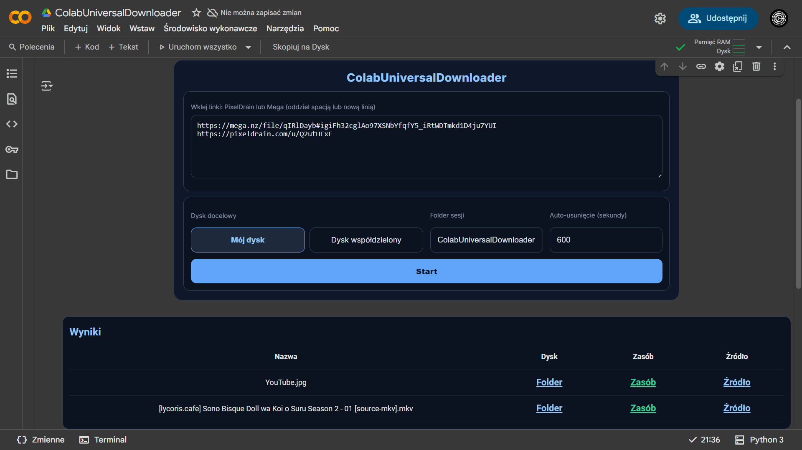

# 🚀 ColabUniversalDownloader

[](https://colab.research.google.com/drive/1bhMiOZJkjIofJhf3F9722piF4GM-vYpZ?usp=sharing)

Lekki interfejs (Colab) do pobierania z PixelDrain i Mega.nz oraz wysyłania do Google Drive z widocznym postępem i tabelą wyników.

## ✨ Funkcje
- Obsługa linków: PixelDrain (pliki) i Mega.nz (pliki oraz publiczne foldery)
- Wysyłka na Google Drive (Mój dysk / Dysk współdzielony), automatyczne tworzenie/odnajdywanie folderu sesji
- Widoczny postęp w osobnym panelu (bez `print` w backendach)
- Wyniki w tabeli: Nazwa, link do folderu na Dysku, link do zasobu, link źródłowy
- Planowane auto-usunięcie folderu sesji (opcjonalne)

## 🧩 Wymagania
- Python 3.10+ (dla uruchomień lokalnych / rozwoju)
- Zależności (minimalne): `requests`, `pycryptodome`, `tqdm`, `typing-extensions`
- Colab: UI działa natywnie w Google Colab (zalecane)

## ▶️ Szybki start (Colab)
1. Otwórz notatnik `ColabUniversalDownloaderUI.ipynb` w Google Colab (lub użyj przycisku „Open in Colab” powyżej).
2. Uruchom jedyną komórkę — uruchomi się cały UI (formularz, panel postępu i tabela wyników); repo i zależności zostaną pobrane automatycznie.
3. Wklej linki z PixelDrain i/lub Mega, wybierz dysk docelowy, ustaw nazwę folderu i auto-usunięcie (opcjonalne).
4. Autoryzacja Google Drive: przy pierwszym uploadzie w danej sesji Colab poprosi o dostęp do Twojego Dysku — zaloguj się, wybierz konto i nadaj uprawnienia. Po restarcie runtime (nowa sesja) autoryzacja będzie wymagana ponownie — to normalne zachowanie Colab.
5. Kliknij Start. Postęp pobierania i wysyłania będzie widoczny w panelu „Postęp”.
6. W „Wynikach” kliknij lub skopiuj link do folderu na Dysku oraz link do zasobu (możesz je łatwo pobrać).

## ℹ️ Uwaga: autoryzacja, prywatność i limity IP
- Autoryzacja: Colab uruchamia izolowane środowiska. Każdy restart runtime to nowa sesja i konieczność ponownej autoryzacji Google Drive.
- Prywatność: Pliki trafiają wyłącznie do wskazanego folderu na Twoim Dysku Google. Narzędzie nie udostępnia automatycznie całego Dysku ani innych plików; widoczność przesłanych zasobów pozostaje pod Twoją kontrolą (możesz zmieniać uprawnienia w Google Drive w dowolnym momencie).
- Limity IP źródeł (PixelDrain/Mega): Jeśli trafisz na ograniczenia pobrań po IP, zrestartuj runtime w Colab (Runtime → Restart runtime) i uruchom notatnik ponownie — zazwyczaj przydzielany jest nowy adres IP i możesz spróbować jeszcze raz.

## 💻 Użycie lokalne (dev)
- Zainstaluj zależności:
```bash
pip install -r requirements.txt
```
- Moduły dostępne w `utils/` (brak drukowania w bibliotekach, tylko wyjątki i callback progresu):
  - `utils/pixeldrain.py`
  - `utils/mega.py`
  - `utils/google_drive.py`

## 🧪 Testy (notebook)
- Otwórz `ColabUniversalDownloaderTests.ipynb` (najlepiej w Colab).
- Komórki testowe pozwalają sprawdzić:
  - Pobieranie z PixelDrain
  - Pobieranie z Mega (plik + folder)
  - Upload do Google Drive i udostępnianie linków

## 🗂️ Struktura projektu
```
.
├─ ColabUniversalDownloaderUI.ipynb     # Jednokomórkowy UI (Colab)
├─ ColabUniversalDownloaderTests.ipynb  # Notatnik testowy
├─ utils/
│  ├─ pixeldrain.py
│  ├─ mega.py
│  ├─ google_drive.py
│  └─ progress.py
├─ requirements.txt
└─ docs/
   ├─ images/                           # Miejsce na zrzuty ekranu
   └─ videos/                           # Miejsce na filmy demo
```

## 🖼️ Zrzuty ekranu



https://github.com/user-attachments/assets/c722023d-3dc1-4084-b0a6-a9af75e9c536
